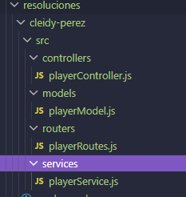

# Backend básico para torneo battle royale
## Nombre
- Cleidy Priscila Pérez Casia

## Dificultad
- Básica retadora

## Temática usada
videojuegos battle royale

### La solución completa
Se crean un carpeta general para que aguarden las subcarpetas y en cada subcarpetas se coloca los archivos correspondientes que en la carpeta.

### Una breve explicación de cómo pensaste el problema.
-Primero crear una carpeta general.
-Como los archivos eran de la misma extensión pero era para diferente trabajos los dividí el rol que debía hacer.

### Evidencia de validación cuando aplique.

## Estructura

- controllers: maneja las solicitudes HTTP.
- services: contiene la lógica de negocio.
- models: representa los datos.
- routes: define las rutas disponibles.