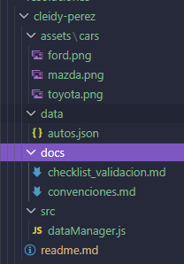

# Catálogo de autos de lujo

## Nombre
- Cleidy Priscila Pérez Casia

## Dificultad
Básica retadora

## Temática usada
autos de lujo

### La solución completa.
Separar como almacenar los datos en los archivos dependiendo de los archivos que contiene como imagenes se aguardan en la carpeta assets y dentro de ella otra carpeta debido a que pueda que agregue mas imgenes de diferentes temas.
### Una breve explicación de cómo pensaste el problema.
- data/: almacena la información de los autos.
- assets/: contiene las imágenes.
- docs/: documentación y validaciones.
- src/: código fuente de la aplicación.
## Evidencia de validación cuando aplique.

