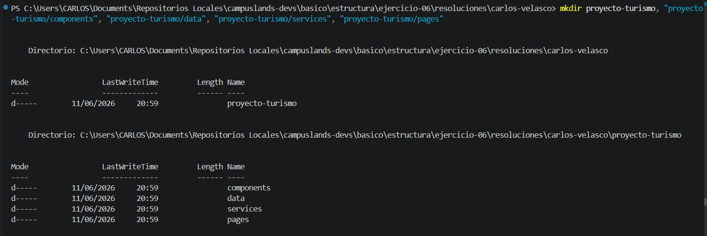
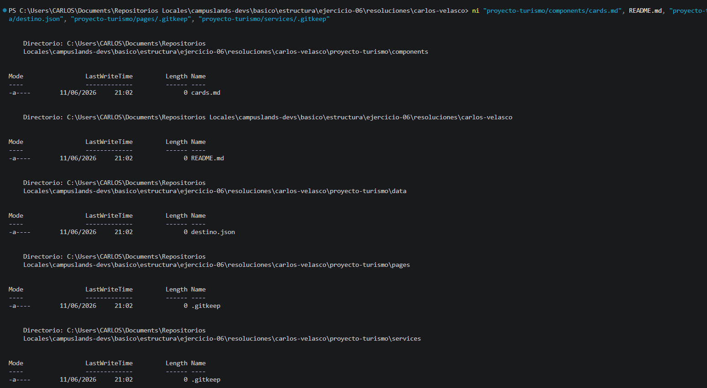

# App de reservas turísticas

Tras definir los requerimientos del ejercicio, se procedió a establecer la arquitectura de directorios necesaria para la organización modular del proyecto de turismo, asegurando la escalabilidad y el registro de la estructura mediante Git.

* **Registro de cambios:** Se crearon las carpetas de trabajo (`components`, `data`, `pages`, `services`) y se generaron los archivos iniciales (`.gitkeep`, `.json`, `.md`). Posteriormente, se añadieron al área de preparación (`staging area`) y se consolidó el progreso mediante un `commit` descriptivo.
* **Sincronización remota:** Se realizó el `push` de los cambios hacia la rama correspondiente en el servidor remoto para asegurar la persistencia de la estructura y facilitar la integración continua.

### Estructura del Proyecto

```text
proyecto-turismo/
├── components/
│   └── card-destino.md
├── data/
│   └── destinos.json
├── pages/
│   └── .gitkeep
├── services/
│   └── .gitkeep
└── README.md

```

### Comandos de Git Utilizados

```bash
# Creación de directorios
mkdir proyecto-turismo
mkdir proyecto-turismo/components
mkdir proyecto-turismo/data
mkdir proyecto-turismo/pages
mkdir proyecto-turismo/services

# Creación de archivos de inicialización
ni proyecto-turismo/components/cards.md, README.md, proyecto-turismo/data/destinos.json, proyecto-turismo/pages/.gitkeep, proyecto-turismo/services/.gitkeep

# Preparar y registrar los cambios realizados
git add .
git commit -m "feat(estructura): ejercicio 06 finalizado"

# Sincronizar el repositorio local con la rama remota
git push -u origin alumnos/carlos-velasco/ejercicio-06

```

## Evidencia





---

**Hecho por:**

* *Carlos Velasco*