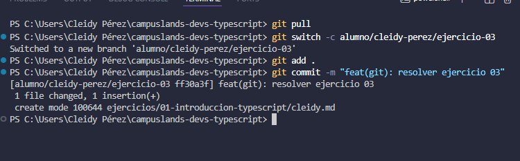

# Rama personal para jugador MOBA
## Nombre
-Cleidy Priscila Pérez Casia

## Dificultad
-Básica retadora

## Temática usada
- videojuegos MOBA

### La solución completa.
Primer era como puedo yo cambiar de rama entonces utilizé "git switch", quiero actualizar los archivos "git pull", para crear una rama y que me deje en esta rama que creé "git switch -c nombre", pero trabaje en esa rama debia subirlo en la nube y hice "git add ." y luego "git commit -m lo que realizé"

### Una breve explicación de cómo pensaste el problema.

-Git switch para cambiar de rama.
-Git pull para actualizar.
-Git switch -c para crear una rama y estar parada en esa rama.
-Git add . para aguardarla.
-Git commit -m para colocarle el nombre del trabajo.
- Git push para que se suba en la nube.

Evidencia de validación cuando aplique.

