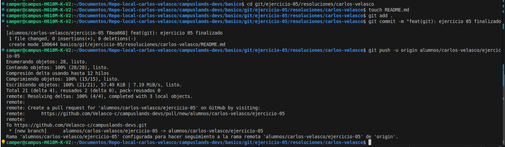
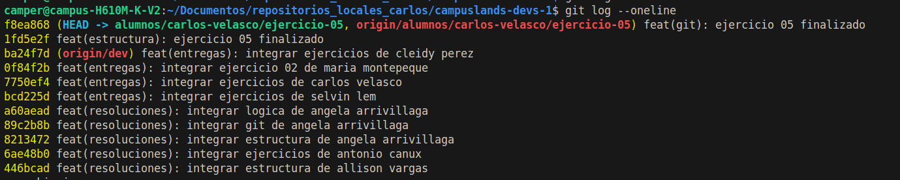

## Push de rama de taller de motos

Tras finalizar la estructura de directorios, se procedió a registrar los cambios en el sistema de control de versiones Git y a sincronizar el proyecto con el repositorio remoto.

* **Registro de cambios:** Se añadieron los archivos al área de preparación (`staging area`) y se consolidó el progreso mediante un `commit` descriptivo.
* **Sincronización remota:** Se realizó el `push` de los cambios hacia la rama correspondiente en el servidor remoto, permitiendo la integración continua y la creación de la *Pull Request* necesaria para la revisión del ejercicio.

### Comandos de Git Utilizados

```bash
# Inicializar el archivo README
touch README.md

# Preparar y registrar los cambios realizados
git add .
git commit -m "feat(git): ejercicio 05 finalizado"

# Sincronizar el repositorio local con la rama remota correspondiente
git push -u origin alumnos/carlos-velasco/ejercicio-05

```

## Evidencia


**Control de versiones (Git):**



---

**Hecho por:**

* *Carlos Velasco*
