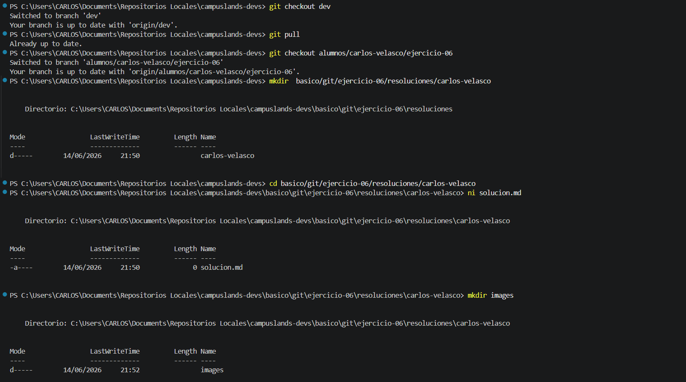

## Estructura y Configuración del Proyecto: Ejercicio-06

Se ha completado la configuración del entorno para el desarrollo del **Ejercicio-06**, enfocándose en la gestión de ramas en Git y la preparación de la estructura de directorios necesaria para la resolución de la tarea.

* **Descripción del proceso:**
* **Gestión de Ramas:** Se realizó la sincronización del repositorio local y se gestionó el cambio a la rama de trabajo específica (`alumnos/carlos-velasco/ejercicio-06`) para asegurar un entorno de trabajo limpio y dedicado.
* **Arquitectura de Directorios:** Se ejecutaron comandos para crear el directorio de resolución del ejercicio (`basico/git/ejercicio-06/resoluciones/carlos-velasco`) y una carpeta adicional para gestionar las evidencias gráficas (`images`).
* **Inicialización de Archivos:** Se creó el archivo `solucion.md` para documentar el progreso y la resolución del ejercicio.
* **Importancia del `git pull`:** La ejecución del comando `git pull` es un paso fundamental para reducir conflictos, ya que permite descargar y fusionar automáticamente las últimas actualizaciones del repositorio remoto en la rama local. Al mantener la copia local sincronizada con el estado actual del servidor antes de realizar nuevos cambios, se minimiza la divergencia entre versiones, evitando así que surjan discrepancias complejas al momento de integrar o subir el código definitivo.


* **Tecnologías:** Terminal (PowerShell), Git para control de versiones.

### Comandos de Git y Shell Utilizados

```bash
# Sincronización y cambio a la rama de trabajo
git checkout dev
git pull
git checkout -b alumnos/carlos-velasco/ejercicio-06

# Creación de la estructura de trabajo
mkdir basico/git/ejercicio-06/resoluciones/carlos-velasco
cd basico/git/ejercicio-06/resoluciones/carlos-velasco
ni solucion.md
mkdir images

# Registro y consolidación de cambios
git add .
git commit -m "feat(git): ejercicio 06 finalizado"
git push -u origin alumnos/carlos-velasco/ejercicio-06

```

### Evidencia



---

**Estructura del Proyecto:**

```text
basico/git/ejercicio-06/resoluciones/carlos-velasco/
├── images/
└── solucion.md

```

**Hecho por:**

* *Carlos Velasco*