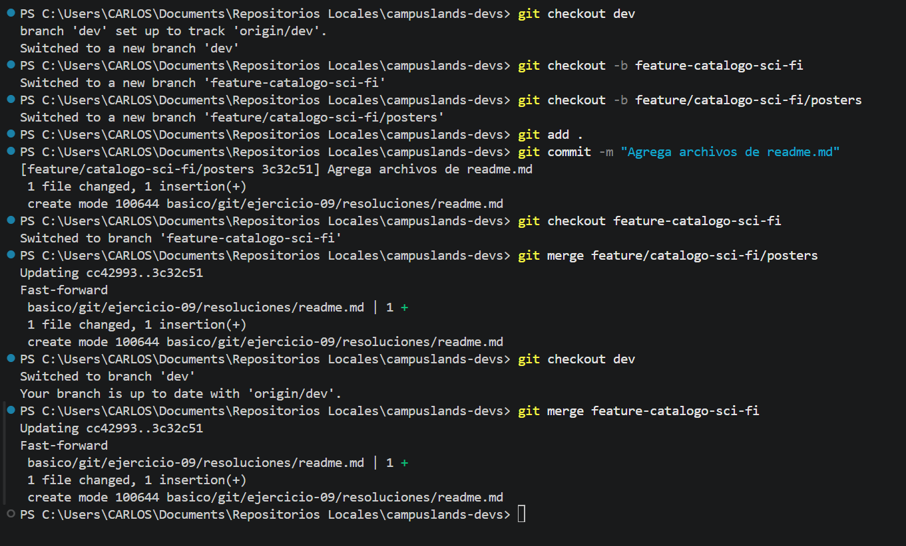

# Trabajo con ramas sobre ramas en película sci-fi

## Gestión de Ramas y Fusión en Git: Flujo Jerárquico

Este proceso documenta la creación de una estructura de trabajo jerárquica en Git, donde se crearon ramas anidadas para organizar cambios específicos, seguido de su integración exitosa en la rama principal `dev`.

* **Descripción del proceso:**
* **Creación jerárquica:** Se generó la rama `feature-catalogo-sci-fi` desde `dev`, y posteriormente una sub-rama `feature/catalogo-sci-fi/posters` para trabajar de manera aislada en el archivo `readme.md`.
* **Integración incremental:** Se realizaron los cambios y el *commit* correspondiente en la rama de nivel inferior. Posteriormente, se realizó una integración mediante *fast-forward* desde la sub-rama hacia `feature-catalogo-sci-fi`, y finalmente, se integró esta última hacia la rama `dev`.
* **Resultado:** Se garantizó la trazabilidad de los cambios manteniendo la limpieza del historial mediante fusiones de avance rápido.


* **Tecnologías:**
* Git (Control de versiones).
* Windows PowerShell.


### Comandos de Git / Lógica del Código

```bash
# Creación de ramas jerárquicas
git checkout -b feature-catalogo-sci-fi
git checkout -b feature/catalogo-sci-fi/posters

# Adición y confirmación de cambios
git add .
git commit -m "Agrega archivos de readme.md"

# Fusión de la sub-rama hacia la rama feature padre
git checkout feature-catalogo-sci-fi
git merge feature/catalogo-sci-fi/posters

# Integración final hacia la rama de desarrollo principal
git checkout dev
git merge feature-catalogo-sci-fi

```

**Evidencia**

* **evidencia.png:** Captura de consola que muestra el flujo completo de creación de ramas (`checkout -b`), los *commits* realizados, y las fusiones (*merge*) sucesivas que culminan en la actualización de la rama `dev`.


**Estructura del Proyecto:**

```plaintext
campuslands-devs/
└── basico/
    └── git/
        └── ejercicio-09/
            └── resoluciones/
                └── readme.md

```

Hecho por:
Carlos Velasco