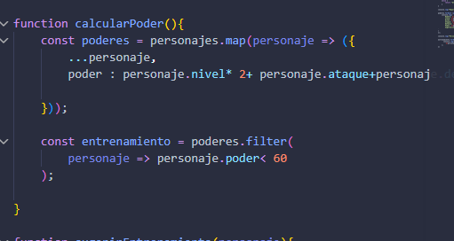

# Gestor de personajes RPG

## Nombre
-Cleidy Priscila Pérez Casia

## Dificultad
Media

## Temática usada
videojuegos RPG

### La solución completa.
Primero se debia recorrer  con map en el array y luego destructurar el array con "nombre del array y colocar tres puntos "para poder ingresar en los datos que se solicitan.

### Una breve explicación de cómo pensaste el problema.

Como puedo ingresar a los datos y por algo especifico, entonces dije utilizar el map o filter para realizar esto y la destruturar el array para ingresar.

### Evidencia de validación cuando aplique.

